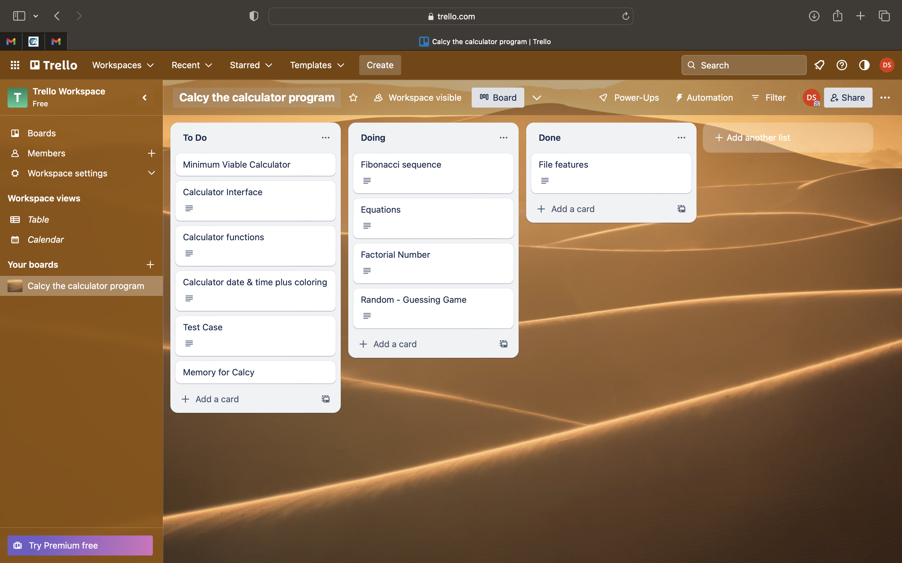

# Calc_Assignment

A calulator program developed in python for the Terminal.

## sources

Chan, L. (2022). How To Call a Python Function With A String? [online] Medium. Available at: https://pub.towardsai.net/python-trick-how-to-call-a-function-by-its-name-f35309469c66.

Python, R. (n.d.). A Python Guide to the Fibonacci Sequence – Real Python. [online] realpython.com. Available at: https://realpython.com/fibonacci-sequence-python/.

Stack Abuse. (n.d.). Writing to a File with Python’s print() Function. [online] Available at: https://stackabuse.com/writing-to-a-file-with-pythons-print-function/.

simpy.readthedocs.io. (n.d.). Overview — SimPy 4.0.2.dev1+g2973dbe documentation. [online] Available at: https://simpy.readthedocs.io/en/latest/.

## Features

- Basic Calulator functions. This program provide the ability to add, subtract, multiply, divide, square, cube as well as simple interest and compund interest functions.
- User interface. This program provides a menu system that allows the user to select functions and print the results to screen.
- Equations. The program is able to do linear algebra in the form of 3x + 7y -10z.
- Guessing game. A simple to guess the number between 1 and 10.
- File output. The program can print the results of calculations to a file. It appends to the file so that you can store a record of the session.

## Implementation

Trello was used as project management software to track build of the features.

